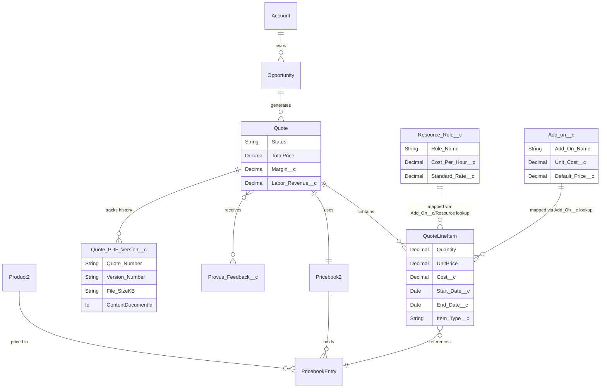

# Provus Express Quoting

Provus Express Quoting is a modern, high-performance CPQ (Configure, Price, Quote) application built natively on Salesforce. It enhances the standard quoting workflow by introducing interactive margin simulations, dynamic timeline visualization, custom quoting additions (labor roles and add-ons), and seamless PDF generation.

## 🚀 Key Features

*   **Smart Margin & Profitability Simulator**: A highly interactive UI that aggregates the total costs versus final revenue, visualizing margin performance through interactive charts and progress rings.
*   **Dynamic Gantt Timeline**: Automatically calculates phase durations based on specific Line Item start and end dates, mapping them onto a seamless drag-free Grid timeline layout.
*   **Extensible Item Management**: Beyond standard Salesforce Products (`Product2`), users can accurately forecast services by dynamically injecting `Resource_Role__c` entries and `Add_on__c` subscriptions.
*   **Version-Controlled PDF Generation**: Automates client-facing template creation directly from the quote record. Tracks generated variants locally in a localized history table for seamless record keeping. 
*   **Approval Lifecycle Visibility**: Democratizes record oversight by pushing native background `ProcessInstance` (Approval) histories to a clean UI without hitting strict profile sharing limitations.

## 🏗️ Architecture Stack

This application emphasizes security and strict engineering patterns across its stack:

*   **Frontend (Lightning Web Components)**: Leverages highly granular, componentized UI. Makes extensive use of CSS Flexbox/Grid algorithms and custom vector graphs (`svg`) paired directly with Salesforce SLDS design tokens.
*   **Backend (Apex CSD Pattern)**: 
    *   **Controllers** (`QuoteService`, `QuoteApprovalController`): Serve as strictly guarded REST-like `@AuraEnabled` endpoints for the frontend LWC framework.
    *   **Services**: Encapsulate high-volume DML patterns and mathematical logic (e.g. margin tracking, rollup recalculations).
    *   **Selectors**: Separate raw SOQL extractions to maintain predictable and scalable query loads.
*   **Data Security**: Embraces native explicit `with sharing`/`without sharing` directives to securely expose data only where contextually appropriate, coupled with restricted Permission Sets (`Provus_Quote_Manager`, `Provus_Quote_User`).

## 🗄️ Object Schema (Entity-Relationship Diagram)

Below is the database architecture indicating how Standard and Custom Objects intersect within the CPQ workflow. 



## 🛠️ Deployment Instructions

1. Retrieve the repository locally.
2. Initialize deployment via the standard Salesforce CLI to your scratching/metadata org:
    ```bash
    sf project deploy start
    ```
3. Assign the base permission sets to users evaluating the tool:
    *   `Provus_Quote_User`: Base level read/write functionality
    *   `Provus_Quote_Manager`: Extends functionality to allow modifications to approval structures and company settings configuration within the App view.
